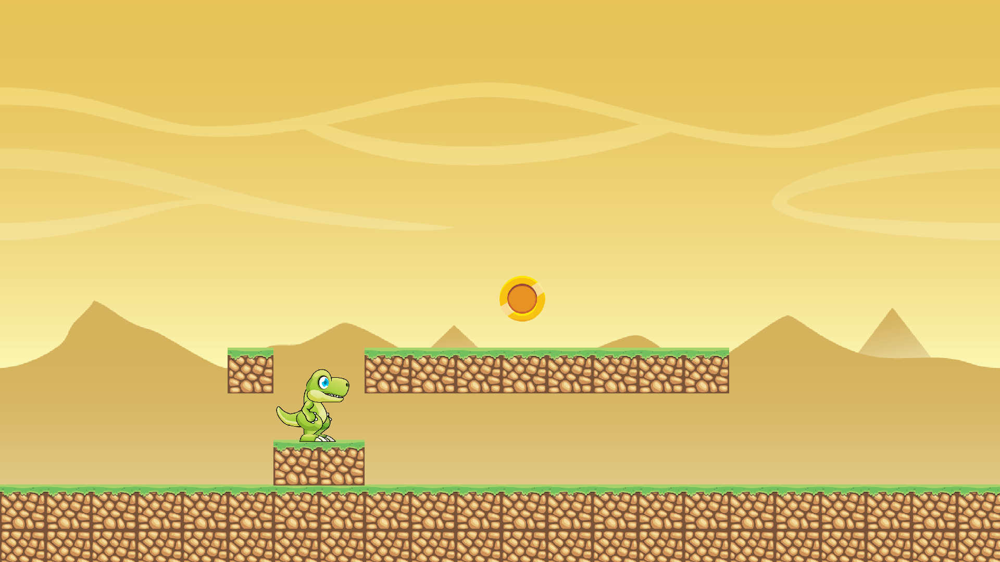
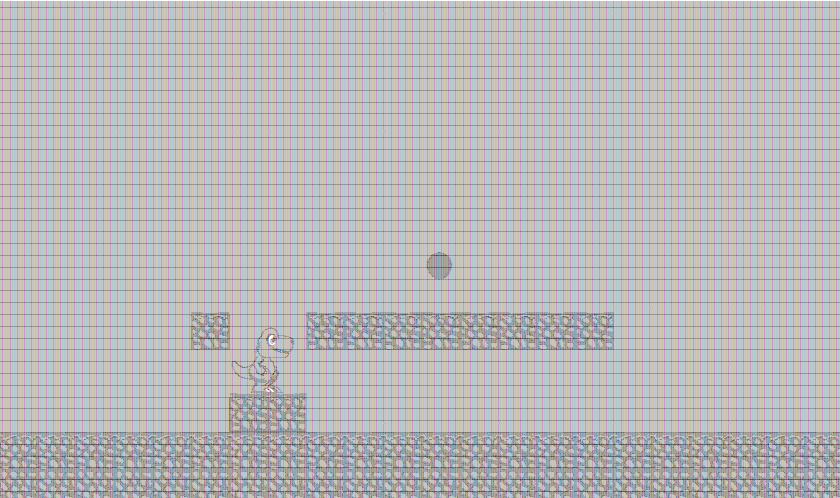

# ASCII Art
A Java implementation of a programm which converts image files into ASCII.

## Table of contents
* [Description](#description)
* [Input](#input)
* [Output](#output)
* [Example](#example)

## Description
The program holds a character set, which in default has the character 0 to 9, and the
programm builds an ASCII representation of a given image, according to the character set
and the resolution. 

## Input
When running the program, '>>>' will appear in the command line. The possible inputs of the programm are strings of the format:
* add commands:
  - "add a" - adds a letter to the character set. In this case, the letter 'a'.
  - "add all" - adds all characters to the character set.
  - "add space" - adds the space character.
  - "add m-p" - adds a range of character. In this case, add all characters from 'm' to 'p'. This will also work with "add p-m".
* remove commands, handled the same way as "add".
* res command - changing the resolution:
  - "res up" - doubles the number of characters per line.
  - "res down" - divides the number of character per line by 2.
* "render" - the output will be rendered to the console and not as an html file.
* "exit" - exits the program.

## Output
As default, the output is an ascii representation of the image as an html file (an example below).
Otherwise, if the user's input is "render", the image will be rendered to the console.

## Example
Original Image:

ASCII representation:

