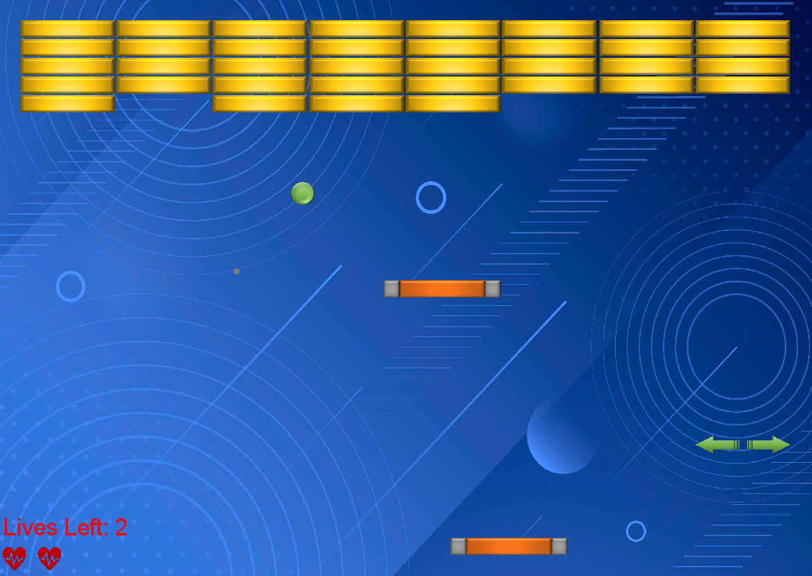

# Bricker
A Java implementation of an "Arkanoid" like game.

## Table of contents
* [Structure](#structure)
* [Designs](#designs)
* [Instructions](#instructions)

## Structure
The Bricker Game is constructed from:

src package:
* The main game's manager, package: gamemanager
* The objects of the game, package: gameobjects
* The strategies of the collision between the ball and the bricks, package: brick_strategies
* There are also additional algorithms question aside from the project. 

## Designs

### BrickerGameManager Design 
BrickerGameManager is designed such that its objects (Ball, Paddle, etc.) are saved
as private instances so that it could manage the whole game from this class, and use
those objects in different methods freely.

### Ball, Puck, Paddle, MockPaddle, Brick Design 
Their design is explained straight forward from the given API.

### BallCollisionCountdownAgent Design 
This object is not rendered in the game, and it's being updated as such:
it collects the ball's number of collisions since being instantiated,
and if it equals or greater than NUM_BALL_COLLISIONS_TO_TURN_OFF,
as it implies - it turns off the fixation of the camera on the main ball.
An object of that class is instantiated through The ChangeCamera strategy.

### NumericLifeCounter Design 
The numeric counter does not receive any renderable, but constructs a new
object within the class which will represent the number of lives and show it
on screen as a number. The class of that renderable is of class TextRenderable.
The update is implemented by using setString, so that the counter changes
at each update according to livesCounter.

### GraphicLifeCounter Design 
In my implementation of the graphical counter, I related to each heart
as a graphic counter object of its own. Each heart relates to its own
numOfLives component, and at each update, if the livesCounter is lower than
a hearts numOfLives, I know that I lost in that round and I need to delete that heart.

### Status Design 
The status is implemented as such: it changes the condition for collision between objects:
a status object will only disappear if it hits a paddle. Therefore I had to
override the method shouldCollideWith to make it collide with objects that only have
the PADDLE_TAG tag, which of course is a tag I gave to paddles and only to them.

### PaddleSizeChanger Design 
I decided to add the extension/shrinking of a paddle behaviour to the game.
This object extends status. It randomly chooses between shrinking and
expanding the paddle and renders a size changer picture accordingly.
When it hits a paddle:
if it's an expanding status - it will double up
the size of the paddle, up until doubling it again will cause the paddle
to be bigger than the x dimension of the game's window.
if it's a shrinking status - it will double down
the size of the paddle, up until it's no shorter than MIN_PADDLE_SIZE pixels.
(*) The velocity of the status is 160 - 20% lower than the main ball's velocity.

### CollisionStrategy Design 
The interface for the collision strategies to follow.

### RemoveBrickStrategyDecorator 
A class using the Decorator design pattern. This class decorates the RemoveBrick
strategy, and I used this design pattern because it's logical to use it if we want
to add behaviour to the bricks whilst still removing it each time a ball hits it,
that is - The brick always disappears when it collides with a ball, but
more things can happen to the game in addition.

### RemoveBrickStrategy 
Just removes the brick whenever a ball hits it.

### PuckStrategy 
3 additional balls are created when a ball hits a brick with this strategy.
The strategy is implemented as such: 3 balls are created and the first ball has
a velocity which is 20% lower than the main ball, the second ball has a velocity which
is greater by ten and the third's velocity is greater by 20, so all 3 balls are slower than
the main ball by at most 20%, and all with different velocities. The reason that I chose them
to have different velocities is due to the fact that when their velocities are the same,
they sometimes looked as if they are one ball instead of 3 and you could hardly distinguish
between them.
(*) The size of the balls is a third of the bricks x dimension.

### AddPaddleStrategy 
An additional paddle is created whenever a ball hits a brick with this strategy,
unless an additional paddle already exists. This paddle disappears after it collides
with 3 objects, not including the walls (boundaries) of the game, and including the ball
or status objects.

### ChangeCameraStrategy 
A ball which hits a brick with this strategy changes the focus of the camera's game
to the main ball (and only that ball, and not pucks if they exist).
The focus is changed only if the screen is in the default position (focused on the
whole game), and if another brick with this strategy gets hit while the focus
is already on the main ball, the strategy does nothing.
(*) the focus on the ball stays up until there are 4 collisions with the ball and
another object (including all the objects of the game, even the walls).
(*) The strategy uses the BallCollisionCountDown Agent to count the number
of collisions the ball has had since the focus has been instantiated,
and if it equals or larger than a given fixed value, the focus goes
back to normal.

### ExpandOrShrinkPaddleStrategy 
A brick with this strategy disappears when a ball hits it and additionally drops
a status object - a PaddleSizeChanger status which, as it implies, expands or shrinks
the paddle. The strategy is implemented as such:
it randomly chooses whether to shrink or expand according to a Random
variable, and puts the result as a string: whether it's "shrink" or "widen",
and then the PaddleSizeChanger knows according to that string whether to shrink
or expand the paddle.
(*) The status can also shrink/expand the additional paddle if it exists.

### MultipleStrategies 
This strategy as it implies holds within it self a couple of strategies.
it randomly chooses 2 behaviours, including the multiple strategy. If
one of them is indeed the multiple strategy itself, it randomly chooses 2 more strategies,
but there will not be more than 3 strategies to a single brick.

## Instructions
Run the main program - BrickerGameManager.java in the gamemanager file and enjoy!

